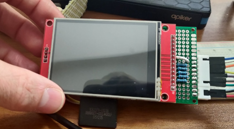
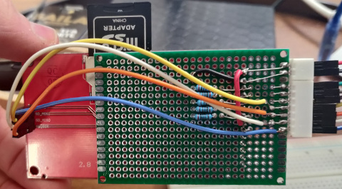

So here I am, starting to work on hardware stuff again, this time with a simple project in mind,
to get a display show stuff from a SD card in order to integrate this in a Mandalorian gauntlet.

For the display, I got a simple 2.8 inch display on Amazon. It comes under various names
and brands, the original being Adafruit, but there are many alternatives and all look the same.
The thing they have in common, they all share the same code-name, ILI9341, which indicate that
they are compatible with the original ILI9341 Adafruit library that functions as a driver.



You may purchase the same device on various sites by using the ILI9341 keyword

The display is pretty cheap, just 13.69 € at the time of writing this article.

It features a 240x320 lcd with LED backlight, a touch screen, and a SD card reader (note:
not MicroSD). It makes use of the SPI interface, meaning that you can drive it with just 2 pins
plus power. The documentation also states that the input pins are not 5V tolerant.

As controller, instead, I'm using an Arduino NANO, actually an unofficial version of it that came
bundled with another purchase I made in the past.

After following many of the tutorials that can easily found on Google or YouTube, I always ended up
in the following situations:

- The display works, with a low refresh rate (3 seconds to fill the screen)
- The display works, but when the SD is initialized, it suddenly stops working
- Neither the display nor the SD card work (white screen)

If you have any of these problems too, and don't know how to solve them, read on and follow me in
the steps I made to find out what I was doing wrong and how to quickly fix it!

## The Wrong Way

The first video tutorial that I found said that (as I mentioned before) since the input pins do
not support 5V, we needed to pull down the voltage to 3.3V by using resistors, and provided a
diagram like this one specifying that all resistors should have value 10k



So I diligently wired it up and loaded a sketch

```arduino
#include <SPI.h>
#include <Wire.h>
#include <Adafruit_GFX.h>
#include <Adafruit_ILI9341.h>

#define TFT_CS   10
#define TFT_RST   9
#define TFT_DC    8
#define TFT_MOSI 11
#define TFT_SCK  13
#define TFT_MISO 12

Adafruit_ILI9341 tft(TFT_CS, TFT_DC, TFT_MOSI, TFT_SCK, TFT_RST, TFT_MISO);

void setup() {
    tft.begin();
    tft.setRotation(1);
    tft.fillScreen(ILI9341_BLUE);
}

void loop() {
    // any other drawing code here
}
```

This worked, but, as said, it was painfully slow. I didn't care of speed at first, and I was
actually prepared for that, as from the video reviews I've seen, they said that with the slow
Arduino nano that was all I could hope for, so I went on to see what I could do with it.
I managed to display monochrome pictures, make grids, and a scanning "animation" with the basic
drawing functions.



Then I attempted to hook up the SD card, so I shared the MOSI, MISO, SCK pins with the TFT ones, and
used a different chip select pin for the SD.

Then came failure: after a call to the SD initialization the TFT became unresponsive.
No more image refresh, nothing. Follows initialization code of the SD (which by the way ran
successfully with the SdFat library)

```arduino
#include <SPI.h>
#include <Wire.h>
#include <SdFat.h>
#include <Adafruit_GFX.h>
#include <Adafruit_ILI9341.h>

#define TFT_CS   10
#define TFT_RST   9
#define TFT_DC    8
#define TFT_MOSI 11
#define TFT_SCK  13
#define TFT_MISO 12

#define SD_CS     7

Adafruit_ILI9341 tft(TFT_CS, TFT_DC, TFT_MOSI, TFT_SCK, TFT_RST, TFT_MISO);

SdFat sd;

void setup() {
    tft.begin();
    tft.setRotation(1);
    tft.fillScreen(ILI9341_BLUE);
    if (!sd.begin(SD_CS, SPI_FULL_SPEED)){
        sd.initErrorPrint();
    }
}

void loop() {
    // any other drawing code here
}
```

## Software SPI vs Hardware SPI

I tore down the project and started from scratch with the connections at least 5 times, searching
through documentation and source codes, and after hours of scavenging I found this hidden in plain
sight under my nose:

File: `Adafruit_ILI9341.cpp`
```arduino
/**************************************************************************/
/*!
    @brief  Instantiate Adafruit ILI9341 driver with software SPI
    @param    cs    Chip select pin #
    @param    dc    Data/Command pin #
    @param    mosi  SPI MOSI pin #
    @param    sclk  SPI Clock pin #
    @param    rst   Reset pin # (optional, pass -1 if unused)
    @param    miso  SPI MISO pin # (optional, pass -1 if unused)
*/
/**************************************************************************/
Adafruit_ILI9341::Adafruit_ILI9341(int8_t cs, int8_t dc, int8_t mosi,
                                   int8_t sclk, int8_t rst, int8_t miso)
    : Adafruit_SPITFT(ILI9341_TFTWIDTH, ILI9341_TFTHEIGHT, cs, dc, mosi, sclk,
                      rst, miso) {}
```

This is the constructor that we used in the first part. It states that using this constructor
forces the display to use SOFTWARE SPI, meaning that even if the pins you use are SPI pins, they
WON'T be used as real SPI. I started thinking that since the SD uses the HARDWARE SPI,
it might be that Software and Hardware SPI were conflicting one with another.

Then I tried using the other constructor:

```arduino
/**************************************************************************/
/*!
    @brief  Instantiate Adafruit ILI9341 driver with hardware SPI using the
            default SPI peripheral.
    @param  cs   Chip select pin # (OK to pass -1 if CS tied to GND).
    @param  dc   Data/Command pin # (required).
    @param  rst  Reset pin # (optional, pass -1 if unused).
*/
/**************************************************************************/
Adafruit_ILI9341::Adafruit_ILI9341(int8_t cs, int8_t dc, int8_t rst)
    : Adafruit_SPITFT(ILI9341_TFTWIDTH, ILI9341_TFTHEIGHT, cs, dc, rst) {}
```

I then changed my code from
`Adafruit_ILI9341 tft(TFT_CS, TFT_DC, TFT_MOSI, TFT_SCK, TFT_RST, TFT_MISO);`
to `Adafruit_ILI9341 tft(TFT_CS, TFT_DC,TFT_RST);`
and found out that the display didn't work at all. White screen, unresponsive.
Only at times it seemed to flicker the color that I wanted it to take, but it lasted for mere
milliseconds.

## Don't trust the internet
Think by yourself. Since I noticed that the display still sometimes flickered with the color I
wanted it to take, I began thinking there was something wrong with the wiring, so I scrapped the
breadboard once more and started to do my calculations. Am I really sure that the input pins
really receive 3V3 and not 5V? Well, from what I understood in my university studies, there was
something fishy: how can a resistor allow the voltage to drop if it's put in series with the
input port? I knew I needed to create a
[voltage divider](https://en.wikipedia.org/wiki/Voltage_divider) in order to make the pin receive
the correct voltage. The current layout didn't really look like a voltage divider, did it?

So I changed the layout yet again:



This time, there are five pairs of resistors, one, smaller, goes in series with the input, the other
instead goes to ground, acting effectively as a voltage divider.
In order to have 3v3, the needed resistor values are R1 = 1k and R2 = 2k.

after connecting the board like this, the Hardware SPI magically started working, and I also
obtained a HUGE speed up in rendering time



## SD Card
It was just a matter of time to try out the SD card reader, but this time it was faster: it seems
like the SD MOSI, CS and SCK are not only 5V tolerant, but they require 5V: if connected to
the voltage divider the SD card didn't read.

In the above video I already get image data from the SD card.

Please note that in the original code nothing else was changed, but the way in which
the TFT is initialized.

## Final considerations
Here you can see the final result of the display mounted on a PCB along with the resistors,
this greatly helps to reduce clutter, both on the breadboard and on the desk. We go from having
more than a dozen cables to just 9.

 

The ILI9341 is a GREAT display and has much more potential than just an image-slideshow for
a cosplay project. I will surely get another one and try to do stuff with it.
